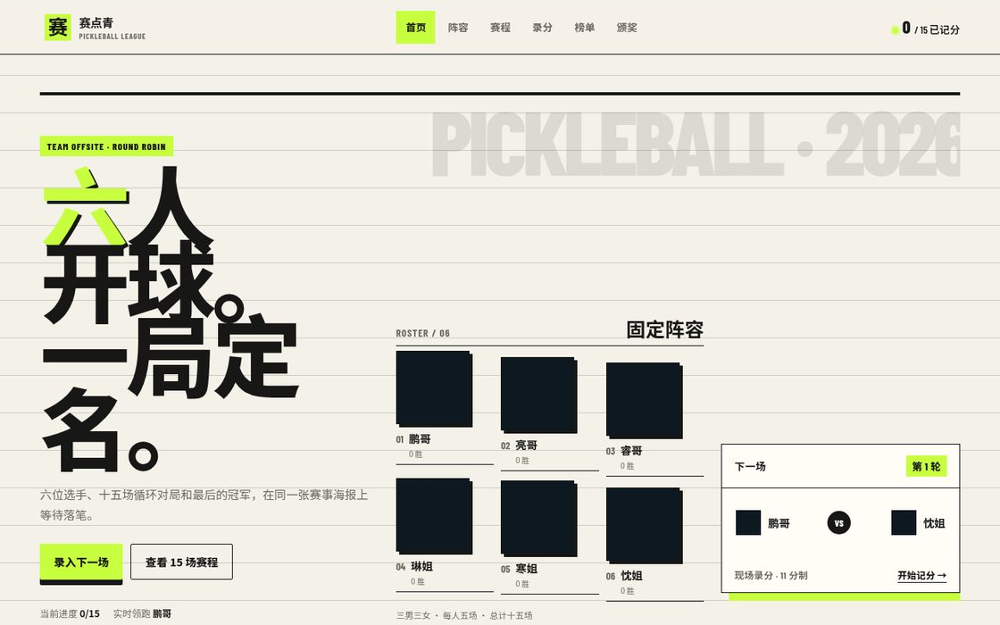
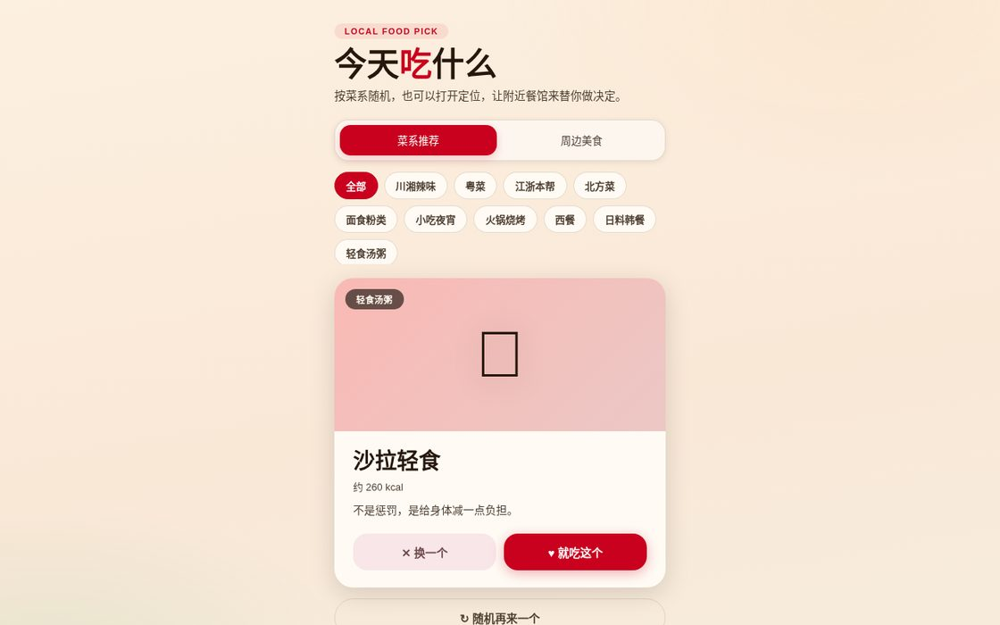
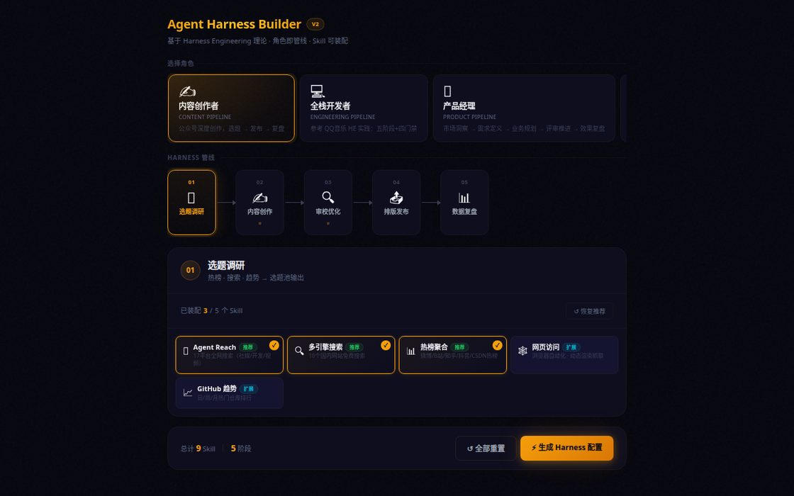
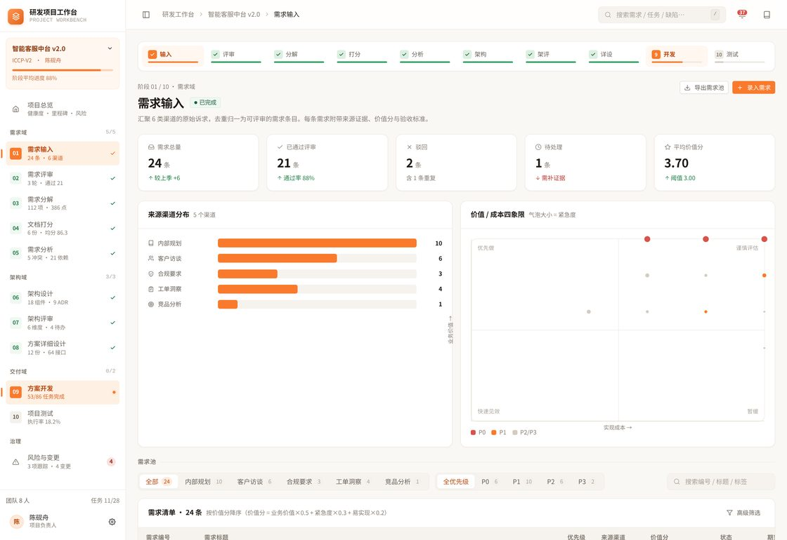
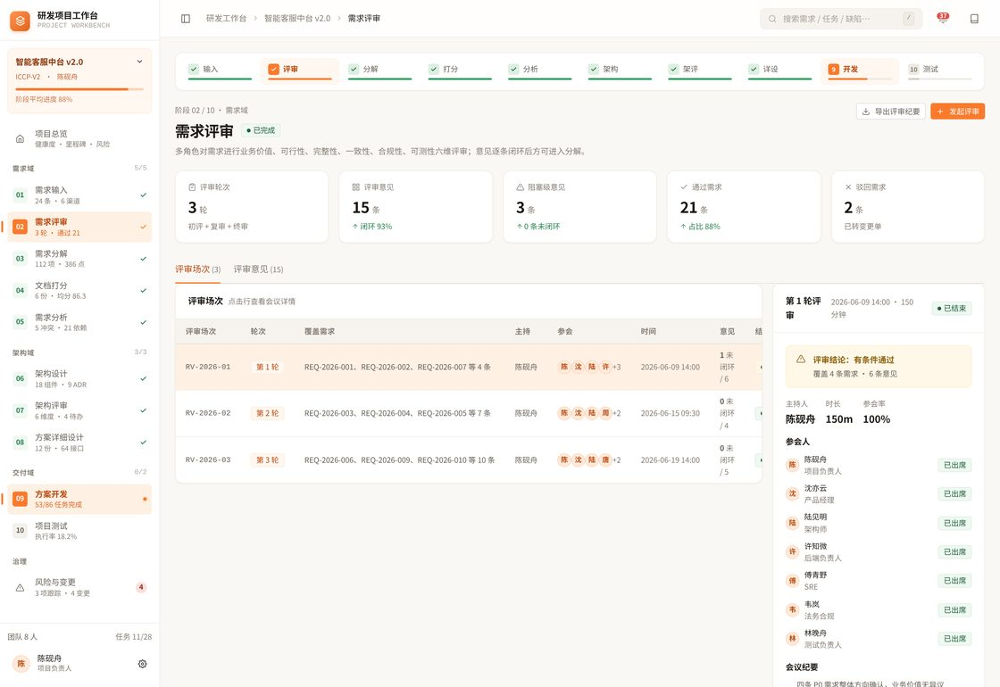
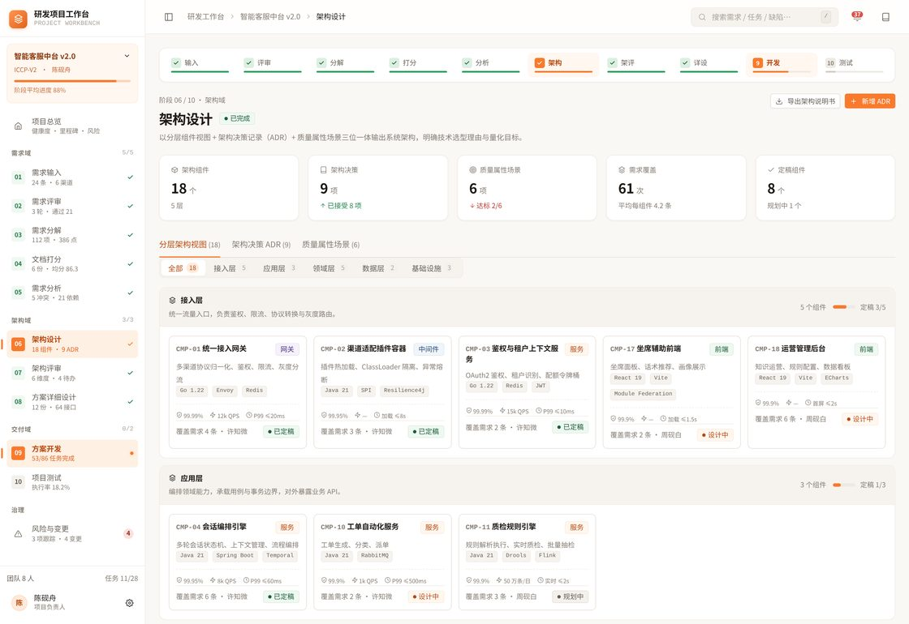
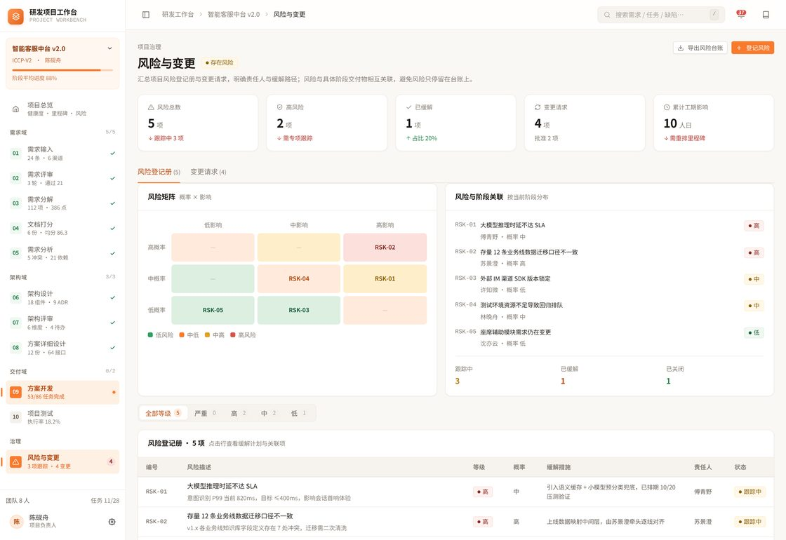
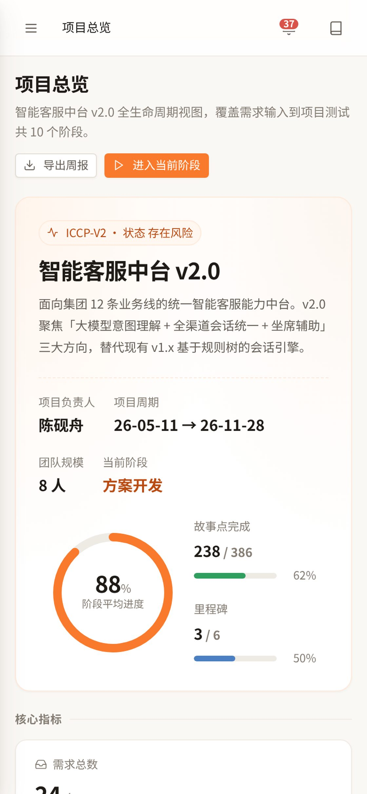

# HaloPage

静态页面小项目集合，用于部署到 Halo / 1Panel / Nginx 的 `/static/xxx/` 路径下。

> 全部项目均为 **纯静态产物** —— 无后端、无 API Key、无数据库，复制即用。
> 另收录一个独立的 AI Demo 展示门户 [`demo-hub/`](demo-hub/)（168 个提示词生成作品）。

---

## 目录

- [项目一览](#项目一览)
- [在线体验](#在线体验)
- [应用截图](#应用截图)
- [项目说明](#项目说明)
- [目录结构](#目录结构)
- [部署方式](#部署方式)
- [重要参考地址](#重要参考地址)
- [许可与来源](#许可与来源)

---

## 项目一览

| # | 项目 | 目录 | 技术形态 | 后端 | 体积 |
|:--|:--|:--|:--|:--|--:|
| 1 | 赛点青 · 匹克球循环赛 | [`PickleballLeague/`](PickleballLeague/) | HTML + CSS + JS | 不需要 | ~60 KB |
| 2 | 今天吃什么 | [`EatHelper/`](EatHelper/) | 单文件 HTML | 不需要 | ~23 KB |
| 3 | 云舟 · 个人作品集 | [`Yunzhou/`](Yunzhou/) | HTML + 视频/字体资源 | 不需要 | ~1.5 MB |
| 4 | Agent 装配台 | [`soul-init/`](soul-init/) | 单文件 HTML | 不需要 | ~34 KB |
| 5 | 项目级研发工作台 | [`requirement-workbench/`](requirement-workbench/) | React 19 + TS 6 + Vite 8 | 不需要 | 需构建 |
| 6 | AI Demo 展示门户 | [`demo-hub/`](demo-hub/) | 纯静态单页 + JS 数据 | 不需要 | ~11 MB |

> 第 5 个项目为构建型应用，仓库**仅保留源码**（未含 `dist/` 与 `node_modules/`），请按下方说明自行构建。
> 第 6 个是独立的展示门户，收录 168 个「一句话提示词 → 游戏 / 交互作品」，与上述 5 个静态小项目无依赖关系。

---

## 在线体验

| 项目 | 线上地址 | 状态 |
|:--|:--|:--|
| **AI Demo 门户（demo-hub）** | <https://ac94b6715f7cb331d.app.workbuddy.host> | 已部署 |
| 赛点青 匹克球 | <https://halopage-pmnzigqu.manus.space> | 作者部署（Manus） |
| 今天吃什么 | <https://thinkspc.fun/static/eat/> | 作者部署 |
| 云舟 · 个人作品集 | `你的域名/static/yunzhou/` | 需自行部署 |
| 云舟视频加载教程 | `你的域名/static/yunzhou/视频加载教程/` | 需自行部署 |
| Agent 装配台 | <https://thinkspc.fun/static/soul-init/> | 作者部署 |
| 研发工作台 | <https://ac8e20005c1f2185e.app.workbuddy.host> | 在线演示 |

---

## 应用截图

> 截图均为构建时用无头浏览器实机抓取（研发工作台部分使用仓库官方素材），非官方宣传图。

### 赛点青 · 匹克球循环赛

固定 3 男 3 女阵容、像素风选手卡片、纸质记分板视觉。



### 今天吃什么

菜系筛选 + 随机推荐卡片，移动端优先布局。



### 云舟 · 个人作品集

视频随指针 scrubbing，晚霞暖色调玻璃拟态。


### Agent 装配台

6 角色 Harness 管线配置与 Skill 装配清单。



### 项目级研发工作台（仓库官方素材）

10 个阶段、12 个页面、一条可追溯的跨阶段证据链。

| 总览 | 需求受理 |
|:--|:--|
|  |  |

| 评审 | 评分 |
|:--|:--|
|  |  |

| 架构设计 | 开发 |
|:--|:--|
|  |  |

| 风险 | 移动端总览 |
|:--|:--|
|  |  |

---

## 项目说明

### 1. 赛点青 · 匹克球循环赛（PickleballLeague）

六人团建比赛比分记录器：

- 固定 3 男、3 女的像素风选手阵容与赛事海报首页
- 自动生成 15 场单打循环赛程
- 本地录入比分，实时更新胜负、得失分与排名
- 全部赛果完成后自动展示冠军、亚军与季军
- 完赛后可生成包含冠亚军及完整积分榜的 PNG 结果海报，支持保存和系统分享
- 纯静态页面，赛事数据仅保存在浏览器 `localStorage`

**技术栈**：原生 HTML / CSS / JavaScript，无框架、无构建。
**验证脚本**：`score-verification.mjs`（算分确定性校验）、`test-poster-export.mjs`（海报导出回归测试）。

### 2. 今天吃什么（EatHelper）

微信可分享的小页面：

- 菜系随机推荐
- 收藏本地保存
- 浏览器定位
- 免费 OpenStreetMap / Overpass API 查询周边美食
- 纯静态，无后端，无 API Key

**技术栈**：单文件 HTML（HTML + CSS + JS 全部内联），约 23 KB。

### 3. 云舟 · 个人作品集（Yunzhou）

鼠标 / 触摸驱动视频时间轴交互主页：

- 视频随鼠标 / 触摸位置 scrubbing（人物转身跟随）
- 晚霞暖色调玻璃拟态 UI，纯静态单页
- 自托管 14 个 woff2 字体 + 星楷字体，首帧占位图避免白屏
- 随附《视频加载教程》：动态视频背景加载方案 · 小白图文教程

**技术栈**：原生 HTML / CSS / JS + HTML5 Video，资源约 1.5 MB。

### 4. Agent 装配台（soul-init）

Agent Harness 构建工具：

- 6 角色管线（需求 / 设计 / 开发 / 测试 / 评审 / 交付）可视化配置
- Skill 装配清单与依赖关系展示
- 纯静态单文件，无后端

**技术栈**：单文件 HTML，约 34 KB。

### 5. 项目级研发工作台（requirement-workbench）

覆盖研发全生命周期的一体化工作台：

- 10 个阶段、12 个页面，一条可追溯的跨阶段证据链
- 需求受理 → 评审 → 评分 → 架构设计 → 开发 → 风险管控
- 数据模型与示例数据内置，可离线演示

**技术栈**：React 19 + TypeScript 6 + Vite 8 + Recharts。

```bash
cd requirement-workbench
npm install
npm run dev      # 开发预览
npm run build    # 产出 dist/
```

**环境要求**：Node.js ≥ 20.19（推荐 22.x）、现代浏览器。

### 6. AI Demo 展示门户（demo-hub）

一个独立的纯静态单页门户，汇集 **168 个「一句话提示词 → 游戏 / 交互作品」** 的在线 Demo：

- 精选 3 个 Claude Opus 5.5 生成的小游戏，支持页内 iframe 直接试玩
- Astra 案例库 165 项，带分类筛选、搜索、分页
- 每个作品均标注 **试玩地址 + 开源源码地址**
- 165 张实机截图（无头浏览器抓取 + 官方素材补齐，JPEG 优化）

**数据来源**：[riba2534/claude-opus-5-5-demo](https://github.com/riba2534/claude-opus-5-5-demo)、[MartinDelophy/awesome-gpt-6-astra](https://github.com/MartinDelophy/awesome-gpt-6-astra)。

详见 [`demo-hub/README.md`](demo-hub/README.md)。

---

## 目录结构

```text
HaloPage/
├── README.md                       # 本文件
├── PRODUCT.md                      # 产品定义：平台 / 用户 / 能力 / 原则
├── DESIGN.md                       # 设计系统：色彩 / 字体 / 布局 / 组件规范
│
├── PickleballLeague/               # ① 赛点青 · 匹克球循环赛
│   ├── index.html                  #    页面结构与功能分区
│   ├── styles.css                  #    赛事编辑部视觉系统
│   ├── app.js                      #    状态 / 赛程生成 / 比分统计
│   ├── score-verification.mjs      #    算分确定性校验脚本
│   ├── test-poster-export.mjs      #    海报导出回归测试
│   ├── SCORE_VERIFICATION.md       #    算分复核记录
│   ├── ideas.md                    #    设计方向说明
│   └── docs/                       #    需求 / 方案 / 交互 / 调研文档
│
├── EatHelper/                      # ② 今天吃什么
│   ├── index.html                  #    单文件应用（HTML+CSS+JS 内联）
│   └── README.md
│
├── Yunzhou/                        # ③ 云舟 · 个人作品集
│   ├── index.html                  #    视频时间轴交互主页
│   ├── assets/
│   │   ├── turn.mp4                #    主视频（1.1 MB）
│   │   ├── poster.jpg              #    视频首帧占位图
│   │   ├── fonts/                  #    14 个自托管 woff2 + 星楷
│   │   └── fonts.css
│   └── 视频加载教程/                #    动态视频背景加载图文教程
│       ├── index.html
│       └── assets/                 #    教程配图
│
├── soul-init/                      # ④ Agent 装配台
│   ├── index.html                  #    单文件应用
│   └── README.md
│
├── requirement-workbench/          # ⑤ 项目级研发工作台（仅源码）
│   ├── package.json
│   ├── vite.config.ts
│   ├── tsconfig*.json
│   └── src/
│       ├── main.tsx                #    入口
│       ├── App.tsx                 #    路由骨架
│       ├── pages/                  #    12 个阶段页面
│       ├── components/             #    布局与 UI 组件
│       ├── data/                   #    数据模型与示例数据
│       └── styles/                 #    tokens / ui / layout / pages
│
├── demo-hub/                       # ⑥ AI Demo 展示门户（独立）
│   ├── index.html                  #    门户主页（精选 + 案例库 + iframe 体验层）
│   ├── astra-data.js               #    案例库数据源（165 项）
│   ├── README.md                   #    门户说明
│   └── shots/                      #    165 张作品截图
│
└── docs-screenshots/               # 界面截图（12 张）
    ├── 01-pickleball.jpg           #    以下 4 张为实机抓取
    ├── 02-eathelper.jpg
    ├── 03-yunzhou.jpg
    ├── 04-soul-init.jpg
    └── wb-*.jpg                    #    研发工作台（仓库官方素材）
```

---

## 部署方式

全部项目均为**纯静态产物**，无构建步骤（研发工作台除外），复制到站点静态目录即可。

### Halo

```bash
# 以赛点青为例
mkdir -p /path/to/site/static/pickleball
cp -r PickleballLeague/* /path/to/site/static/pickleball/
```

访问：

```text
https://你的域名/static/pickleball/
```

其余项目同理，把目录名换成 `eat`、`yunzhou`、`soul-init`。

### 1Panel / Nginx

把项目文件夹放入站点根目录或 `static/` 下，确保目录索引与静态资源规则正常即可。

### 目录约定

| 项目 | 目标路径 | 访问地址 |
|:--|:--|:--|
| 赛点青 | `/static/pickleball/` | `你的域名/static/pickleball/` |
| 今天吃什么 | `/static/eat/` | `你的域名/static/eat/` |
| 云舟 | `/static/yunzhou/` | `你的域名/static/yunzhou/` |
| 云舟教程 | `/static/yunzhou/视频加载教程/` | `你的域名/static/yunzhou/视频加载教程/` |
| Agent 装配台 | `/static/soul-init/` | `你的域名/static/soul-init/` |

### 本地预览

```bash
# 在仓库根目录下起任意静态服务
python3 -m http.server 8000
# 打开 http://localhost:8000/PickleballLeague/
```

---

## 重要参考地址

### 仓库

| 资源 | 地址 |
|:--|:--|
| **本项目仓库** | <https://github.com/xiaopengs/HaloPage> |
| 仓库 API | <https://api.github.com/repos/xiaopengs/HaloPage> |
| 原始文件直链 | `https://raw.githubusercontent.com/xiaopengs/HaloPage/main/<路径>` |
| 作者主页 | <https://github.com/xiaopengs> |

### 项目目录

| 项目 | 仓库路径 |
|:--|:--|
| 赛点青 匹克球 | [`PickleballLeague/`](https://github.com/xiaopengs/HaloPage/tree/main/PickleballLeague) |
| 今天吃什么 | [`EatHelper/`](https://github.com/xiaopengs/HaloPage/tree/main/EatHelper) |
| 云舟 作品集 | [`Yunzhou/`](https://github.com/xiaopengs/HaloPage/tree/main/Yunzhou) |
| Agent 装配台 | [`soul-init/`](https://github.com/xiaopengs/HaloPage/tree/main/soul-init) |
| 研发工作台 | [`requirement-workbench/`](https://github.com/xiaopengs/HaloPage/tree/main/requirement-workbench) |
| AI Demo 门户 | [`demo-hub/`](https://github.com/xiaopengs/HaloPage/tree/main/demo-hub) |

### 文档与规范

| 内容 | 地址 |
|:--|:--|
| 产品定义 | [`PRODUCT.md`](PRODUCT.md) |
| 设计系统 | [`DESIGN.md`](DESIGN.md) |
| 算分复核 | [`PickleballLeague/SCORE_VERIFICATION.md`](PickleballLeague/SCORE_VERIFICATION.md) |
| 赛点青需求 | [`PickleballLeague/docs/项目需求说明书.md`](PickleballLeague/docs/项目需求说明书.md) |
| 赛点青方案 | [`PickleballLeague/docs/项目方案设计.md`](PickleballLeague/docs/项目方案设计.md) |
| 赛点青交互 | [`PickleballLeague/docs/交互设计说明.md`](PickleballLeague/docs/交互设计说明.md) |
| 研发工作台说明 | [`requirement-workbench/README.md`](https://github.com/xiaopengs/HaloPage/blob/main/requirement-workbench/README.md) |
| Demo 门户说明 | [`demo-hub/README.md`](demo-hub/README.md) |

### 数据来源与上游项目

| 项目 | 地址 |
|:--|:--|
| Astra 案例库（demo-hub 数据源） | <https://github.com/MartinDelophy/awesome-gpt-6-astra> |
| Claude Opus 5.5 Demo（demo-hub 精选） | <https://github.com/riba2534/claude-opus-5-5-demo> |

### 外部参考

| 内容 | 地址 |
|:--|:--|
| QQ 音乐 Harness Engineering 实践 | <https://mp.weixin.qq.com/s?__biz=Mzg4Nzc3MjA3Nw==&mid=2247483813&idx=1&sn=97b4b487b571c4ab394e4ad5a6dd4b4f> |
| OpenStreetMap | <https://www.openstreetmap.org> |
| Overpass API（周边美食查询） | <https://overpass-api.de> |
| Halo 博客系统 | <https://www.halo.run> |
| 1Panel | <https://1panel.cn> |
| Nginx | <https://nginx.org> |
| React | <https://react.dev> |
| TypeScript | <https://www.typescriptlang.org> |
| Vite | <https://vite.dev> |
| Recharts | <https://recharts.org> |

### 线上部署

| 用途 | 地址 |
|:--|:--|
| AI Demo 门户 | <https://ac94b6715f7cb331d.app.workbuddy.host> |
| 作者 PickleballLeague 部署 | <https://halopage-pmnzigqu.manus.space> |
| 作者 EatHelper 部署 | <https://thinkspc.fun/static/eat/> |
| 作者 soul-init 部署 | <https://thinkspc.fun/static/soul-init/> |
| 研发工作台演示 | <https://ac8e20005c1f2185e.app.workbuddy.host> |

---

## 许可与来源

- 源码版权归原作者 [xiaopengs](https://github.com/xiaopengs) 所有
- `requirement-workbench` 在其 README 中标注 MIT；仓库根目录未声明统一许可证
- `demo-hub/` 的数据来源于上述上游仓库，截图部分取自上游官方素材，版权归原仓库作者所有
- 各项目为独立小工具，作者声明与原厂无关
