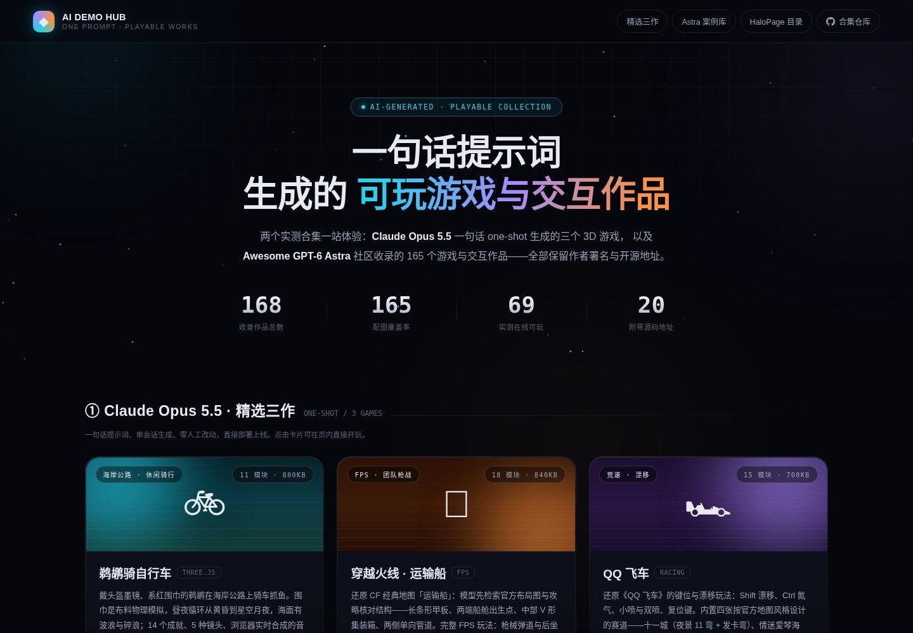
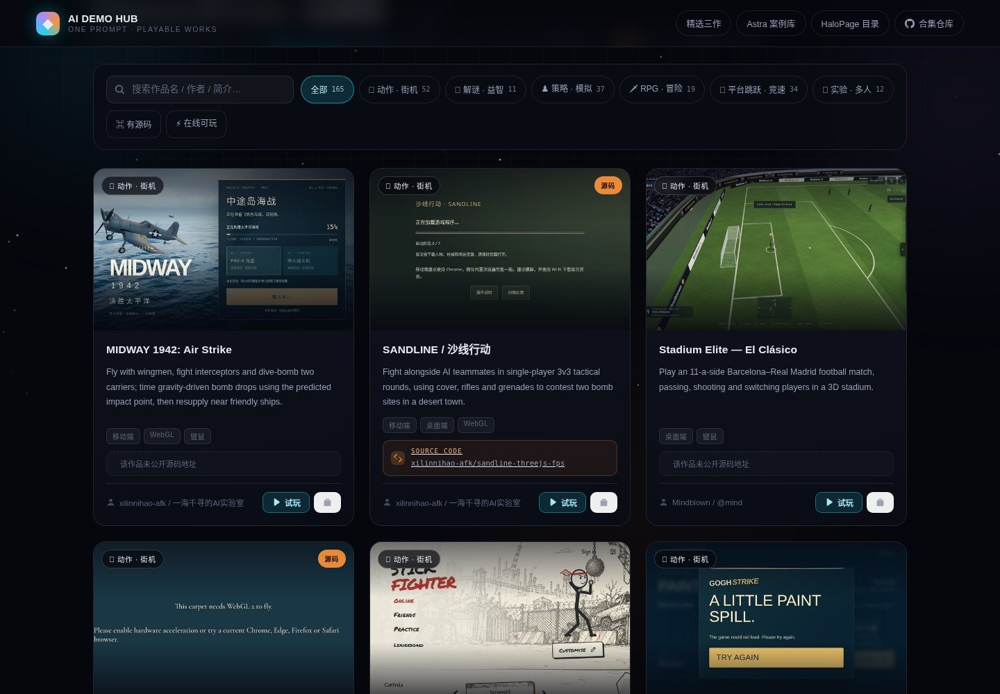
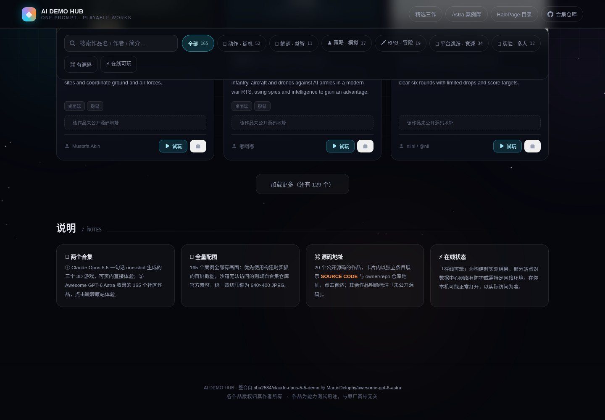

# AI Demo Hub · 提示词生成作品展示门户

一个纯静态的单页展示门户，汇集 **168 个「一句话提示词 → 游戏 / 交互作品」** 的在线 Demo，带截图墙、分类筛选、搜索分页，每个作品均标注 **试玩地址 + 开源源码地址 + 实机截图**。

> 线上已部署：<https://ac94b6715f7cb331d.app.workbuddy.host>

## 内容构成

| 板块 | 内容 | 数量 |
|:--|:--|--:|
| 精选推荐 | Claude Opus 5.5 生成的三个小游戏，支持页内 iframe 直接试玩 | 3 |
| Astra 案例库 | GPT-6 Astra 生成的游戏与交互作品，含分类 / 搜索 / 分页 | 165 |
| 截图墙 | 无头浏览器实机抓取 + 官方素材补齐，16:10 统一规格 | 165 |
| 源码索引 | 每个作品的开源仓库地址（点击直达 GitHub） | 20 |

## 应用截图

### 门户首页

作品总数、截图覆盖、实测在线、附带源码地址四项统计，以及 Claude Opus 5.5 精选三作。



### Astra 案例库

165 个案例的卡片墙，每张含实机截图、平台标签、开源源码地址与试玩入口。



### 说明区块

两个合集介绍、全量截图口径、源码地址收录范围与在线状态的实测方法。



## 目录结构

```
demo-hub/
├── index.html          # 门户主页（精选 + 案例库 + 全屏 iframe 体验层）
├── astra-data.js       # 案例库数据源（165 项：名称/分类/截图/试玩/源码地址）
└── shots/              # 165 张作品截图（JPEG，约 5.2MB）
```

## 本地预览

```bash
cd demo-hub
python3 -m http.server 8000
# 打开 http://localhost:8000/
```

无构建步骤、无后端依赖，任意静态目录（Halo / 1Panel / Nginx / GitHub Pages）可直接部署。

本仓库根目录另有 `PickleballLeague/`、`EatHelper/`、`Yunzhou/`、`soul-init/`、`requirement-workbench/`
五个独立静态小项目，以及根 `index.html` 索引页与 `docs-screenshots/` 界面截图，
详见仓库根 [`README.md`](../README.md)。

无构建步骤、无后端依赖，任意静态目录（Halo / 1Panel / Nginx / GitHub Pages）可直接部署。

## 部署

```bash
# 以 Halo 为例：把 demo-hub/ 放入站点静态目录
/path/to/site/static/demo-hub/
# 访问 https://你的域名/static/demo-hub/
```

## 数据来源

- 精选三作：[riba2534/claude-opus-5-5-demo](https://github.com/riba2534/claude-opus-5-5-demo)
- Astra 案例库：[MartinDelophy/awesome-gpt-6-astra](https://github.com/MartinDelophy/awesome-gpt-6-astra)
- 截图除实机抓取外，部分取自上游仓库官方素材，版权归原仓库作者所有
