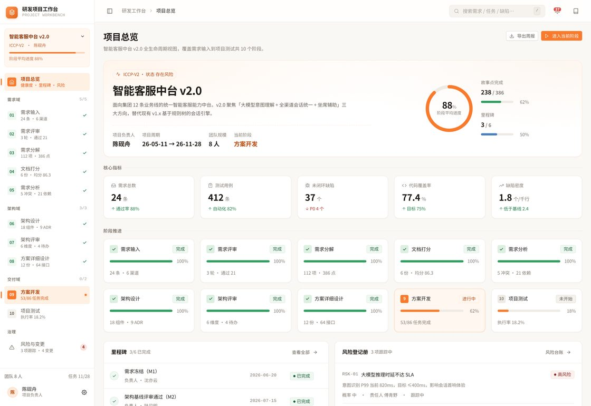
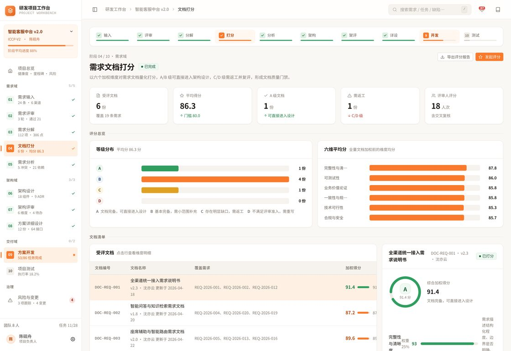
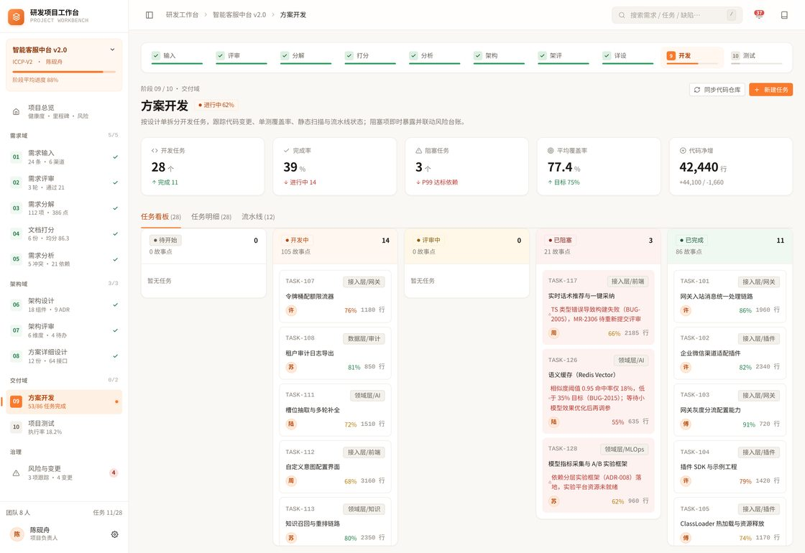

# HaloPage · 静态页面项目集合（快照归档）

> 一组可直接部署到 **Halo / 1Panel / Nginx** 静态目录的纯静态小项目 —— 无后端、无 API Key、无数据库，复制即用。
>
> **本目录是 [xiaopengs/HaloPage](https://github.com/xiaopengs/HaloPage) 的完整快照。** 上游原始说明见 [`README.upstream.md`](README.upstream.md)，本文件为增强版归档说明。
>
> **源码零改动**：45 个文件与上游逐字节一致（体积逐一校验通过）。

---

## 目录

- [项目一览](#项目一览)
- [在线体验](#在线体验)
- [应用截图](#应用截图)
- [项目说明](#项目说明)
- [目录结构](#目录结构)
- [部署方式](#部署方式)
- [重要参考地址](#重要参考地址)
- [许可与来源](#许可与来源)

---

## 项目一览

| # | 项目 | 目录 | 技术形态 | 后端 | 体积 |
|:--|:--|:--|:--|:--|--:|
| 1 | 赛点青 · 匹克球循环赛 | `PickleballLeague/` | HTML + CSS + JS | 不需要 | ~60 KB |
| 2 | 今天吃什么 | `EatHelper/` | 单文件 HTML | 不需要 | ~23 KB |
| 3 | 云舟 · 个人作品集 | `Yunzhou/` | HTML + 视频/字体资源 | 不需要 | ~1.5 MB |
| 4 | Agent 装配台 | `soul-init/` | 单文件 HTML | 不需要 | ~34 KB |
| 5 | 项目级研发工作台 | `requirement-workbench/` | React 19 + TS 6 + Vite 8 | 不需要 | 需构建 |

> 第 5 个项目为构建型应用，本快照**仅保留源码**（未含 `dist/` 与 `node_modules/`），请按下方说明自行构建。

---

## 在线体验

| 项目 | 线上地址 | 状态 |
|:--|:--|:--|
| **门户总入口** | <https://ac94b6715f7cb331d.app.workbuddy.host> | 已部署（本快照的对外地址） |
| **本快照索引页** | <https://ac94b6715f7cb331d.app.workbuddy.host/halo-page/index.html> | 已部署，5 个项目卡片直达 |
| 赛点青 匹克球 | <https://halopage-pmnzigqu.manus.space> | 作者部署（Manus） |
| 今天吃什么 | <https://thinkspc.fun/static/eat/> | 作者部署 |
| 云舟 · 个人作品集 | `你的域名/static/yunzhou/` | 需自行部署 |
| 云舟视频加载教程 | `你的域名/static/yunzhou/视频加载教程/` | 需自行部署 |
| Agent 装配台 | <https://thinkspc.fun/static/soul-init/> | 作者部署 |
| 研发工作台 | <https://ac8e20005c1f2185e.app.workbuddy.host> | 在线演示 |

---

## 应用截图

> 截图均为构建时用无头浏览器实机抓取（研发工作台部分使用仓库官方素材），非官方宣传图。

### 赛点青 · 匹克球循环赛

固定 3 男 3 女阵容、像素风选手卡片、纸质记分板视觉。


### 今天吃什么

菜系筛选 + 随机推荐卡片，移动端优先布局。


### 云舟 · 个人作品集

视频随指针 scrubbing，晚霞暖色调玻璃拟态。


### Agent 装配台

6 角色 Harness 管线配置与 Skill 装配清单。


### 项目级研发工作台（仓库官方素材）

跨阶段证据链首页 —— 从风险回溯到缺陷闭环。



<details>
<summary><b>展开更多工作台截图</b>（需求输入 / 评审 / 评分 / 架构 / 开发 / 风险 / 移动端）</summary>

| 需求输入 | 评审记录 |
|:--|:--|
|  |  |

| 需求评分 | 架构设计 |
|:--|:--|
|  |  |

| 开发看板 | 风险台账 |
|:--|:--|
|  |  |

移动端适配：


</details>

---

## 项目说明

### 1. 赛点青 · 匹克球循环赛（PickleballLeague）

六人团建匹克球**单打单循环**赛程与比分记录器，服务于现场赛事组织者。

**赛制规则**

| 项目 | 约定 |
|:--|:--|
| 人数 | 固定 6 人（3 男 3 女）：鹏哥、亮哥、睿哥、琳姐、寒姐、忱姐 |
| 赛制 | 单循环单打，`6 × 5 ÷ 2 = 15` 场，每人 5 场 |
| 比分 | 11 分制，胜方需至少 11 分且领先 2 分，**不允许同分** |
| 积分 | 胜 1 分、负 0 分 |
| 排名 | 积分 → 净胜分 → 总得分 → 固定报名顺序 |
| 冠亚军 | 15 场全部完成后，积分榜第 1 名冠军、第 2 名亚军 |
| 存储 | `localStorage`，重置只清比分、保留固定名单 |

**功能**：自动生成 15 场赛程、实时积分榜、下一场记分票、赛后冠亚季军展示、**PNG 结果海报导出**（支持系统分享）。

**确定性校验**：内置 `score-verification.mjs`，可复核赛程数量、选手场次、积分与得失分；`test-poster-export.mjs` 为海报导出回归测试。

📄 详细文档：[项目需求说明书](PickleballLeague/docs/项目需求说明书.md) · [项目方案设计](PickleballLeague/docs/项目方案设计.md) · [交互设计说明](PickleballLeague/docs/交互设计说明.md) · [算分复核](PickleballLeague/SCORE_VERIFICATION.md)

### 2. 今天吃什么（EatHelper）

移动端优先的菜系随机推荐页面，适合微信 / QQ 分享。

- 按菜系随机推荐菜品
- 收藏功能，数据存 `localStorage`
- 浏览器定位 + **免费** OpenStreetMap / Overpass API 查询周边美食
- 支持分享 / 复制链接
- 无需后端，**无需 API Key**

### 3. 云舟 · 个人作品集（Yunzhou）

鼠标 / 触摸驱动的视频时间轴交互主页。

- 视频随指针位置 scrubbing，人物转身跟随
- 晚霞暖色调玻璃拟态 UI，纯静态单页
- 随附《视频加载教程》：动态视频背景加载方案（小白图文教程，位于 `视频加载教程/`）

技术要点：14 个自托管 woff2 字体、`poster.jpg` 首帧占位、1.1 MB `turn.mp4`。

### 4. Agent 装配台（soul-init）

基于 QQ 音乐 **Harness Engineering** 理论构建的 Agent 装配台。

- 6 个角色的 Harness 管线：内容创作 / 开发 / 产品 / 运维 / 运营 / 数据
- 每个角色 **5 阶段管线 + 强制门禁**
- **39 个 Skill** 按阶段节点装配（含推荐默认值与外部运行时工具）
- 生成完整 MD 配置：管线图 + 阶段明细 + 安装命令 + Skill 清单

### 5. 项目级研发工作台（requirement-workbench）

覆盖软件研发**全生命周期**的一体化工作台，**10 个阶段 / 12 个页面 / 一条可追溯的跨阶段证据链**。

与传统项目管理看板的区别：**不孤立堆叠模块**，而是用数据链串联阶段 —— 任一指标异常都可沿引用关系回溯源头：

```text
RSK-01 大模型推理时延不达 SLA
   └─> TASK-126 开发任务阻塞
         └─> BUG-2002 缺陷未闭环
```

**十个阶段**：需求池 → 评审 → WBS 分解 → 文档质量门禁 → 需求分析 → 架构决策 → 详细设计 → 开发看板 → 测试执行 → 风险台账

**技术栈**

| 层次 | 选型 | 说明 |
|:--|:--|:--|
| 框架 | **React 19.2** | 函数组件 + Hooks，`useMemo` 缓存派生计算 |
| 语言 | **TypeScript 6.0** | 全量类型覆盖，`strict` 模式 |
| 构建 | **Vite 8.3** | 极速冷启动与 HMR，生产构建基于 rolldown |
| 路由 | **React Router 7.18** | 嵌套路由 + `<Outlet />` 共享骨架 |
| 图表 | **Recharts 3.10** | 进度环、趋势线、分布图 |
| 样式 | 原生 CSS + 自定义属性 | 无 UI 框架、无 CSS-in-JS，四层样式文件 |
| 图标 | 手写内联 SVG | 58 个图标，零外部依赖，统一 24×24 viewBox |
| 检查 | **oxlint** | 极快的 Rust 实现 linter |

> **为何不用组件库？** 这是演示高保真设计系统的项目，Ant Design / MUI 的默认视觉会覆盖「浅色系 + 暖色调」的设计意图。全手写样式换来 49 KB CSS（gzip 后 9 KB）与完全可控的观感。

**构建方式**（本快照未含产物）

```bash
cd requirement-workbench
npm install
npm run build      # 产物输出到 dist/
npm run preview    # 本地预览
```

**环境要求**：Node.js ≥ 20.19（推荐 22.x）、现代浏览器。

---

## 目录结构

```text
halo-page/
├── index.html                      # ★ 快照索引页（项目导航 + 截图）
├── README.md                       # 本文件（增强版归档说明）
├── README.upstream.md              # 上游原始 README（存档用）
├── PRODUCT.md                      # 产品定义：平台 / 用户 / 能力 / 原则
├── DESIGN.md                       # 设计系统：色彩 / 字体 / 布局 / 组件规范
├── skills-lock.json                # Agent 技能锁文件
│
├── PickleballLeague/               # ① 赛点青 · 匹克球循环赛
│   ├── index.html                  #    页面结构与功能分区
│   ├── styles.css                  #    赛事编辑部视觉系统
│   ├── app.js                      #    状态 / 赛程生成 / 比分统计
│   ├── score-verification.mjs      #    算分确定性校验脚本
│   ├── test-poster-export.mjs      #    海报导出回归测试
│   ├── SCORE_VERIFICATION.md       #    算分复核记录
│   ├── ideas.md                    #    设计方向说明
│   └── docs/                       #    需求 / 方案 / 交互 / 调研文档
│
├── EatHelper/                      # ② 今天吃什么
│   ├── index.html                  #    单文件应用（HTML+CSS+JS 内联）
│   └── README.md
│
├── Yunzhou/                        # ③ 云舟 · 个人作品集
│   ├── index.html                  #    视频时间轴交互主页
│   ├── assets/
│   │   ├── turn.mp4                #    主视频（1.1 MB）
│   │   ├── poster.jpg              #    视频首帧占位图
│   │   ├── fonts/                  #    14 个自托管 woff2 + 星楷
│   │   └── fonts.css
│   └── 视频加载教程/                #    动态视频背景加载图文教程
│       ├── index.html
│       └── assets/                 #    教程配图
│
├── soul-init/                      # ④ Agent 装配台
│   ├── index.html                  #    单文件应用
│   └── README.md
│
├── requirement-workbench/          # ⑤ 项目级研发工作台（仅源码）
│   ├── package.json
│   ├── vite.config.ts
│   ├── tsconfig*.json
│   └── src/
│       ├── main.tsx                #    入口
│       ├── App.tsx                 #    路由骨架
│       ├── pages/                  #    12 个阶段页面
│       ├── components/             #    布局与 UI 组件
│       ├── data/                   #    数据模型与示例数据
│       └── styles/                 #    tokens / ui / layout / pages
│
└── docs-screenshots/               # 界面截图（12 张）
    ├── 01-pickleball.jpg           #    以下 4 张为实机抓取
    ├── 02-eathelper.jpg
    ├── 03-yunzhou.jpg
    ├── 04-soul-init.jpg
    └── wb-*.jpg                    #    研发工作台（仓库官方素材）
```

---

## 部署方式

全部项目均为**纯静态产物**，无构建步骤（研发工作台除外），复制到站点静态目录即可。

### Halo

```bash
# 以赛点青为例
mkdir -p /path/to/site/static/pickleball
cp -r PickleballLeague/* /path/to/site/static/pickleball/
```

访问：

```text
https://你的域名/static/pickleball/
```

其余项目同理，把目录名换成 `eat`、`yunzhou`、`soul-init`。

### 1Panel / Nginx

把项目文件夹放入站点根目录或 `static/` 下，确保目录索引与静态资源规则正常即可。

### 目录约定

| 项目 | 目标路径 | 访问地址 |
|:--|:--|:--|
| 赛点青 | `/static/pickleball/` | `你的域名/static/pickleball/` |
| 今天吃什么 | `/static/eat/` | `你的域名/static/eat/` |
| 云舟 | `/static/yunzhou/` | `你的域名/static/yunzhou/` |
| 云舟教程 | `/static/yunzhou/视频加载教程/` | `你的域名/static/yunzhou/视频加载教程/` |
| Agent 装配台 | `/static/soul-init/` | `你的域名/static/soul-init/` |

### 本地预览

```bash
# 在 halo-page 目录下起任意静态服务
python3 -m http.server 8000
# 打开 http://localhost:8000/
```

---

## 重要参考地址

### 上游仓库

| 资源 | 地址 |
|:--|:--|
| **本项目仓库** | <https://github.com/xiaopengs/HaloPage> |
| 仓库 API | <https://api.github.com/repos/xiaopengs/HaloPage> |
| 原始文件直链 | `https://raw.githubusercontent.com/xiaopengs/HaloPage/main/<路径>` |
| 作者主页 | <https://github.com/xiaopengs> |

### 子项目目录

| 项目 | 仓库路径 |
|:--|:--|
| 赛点青 匹克球 | [`PickleballLeague/`](https://github.com/xiaopengs/HaloPage/tree/main/PickleballLeague) |
| 今天吃什么 | [`EatHelper/`](https://github.com/xiaopengs/HaloPage/tree/main/EatHelper) |
| 云舟 作品集 | [`Yunzhou/`](https://github.com/xiaopengs/HaloPage/tree/main/Yunzhou) |
| Agent 装配台 | [`soul-init/`](https://github.com/xiaopengs/HaloPage/tree/main/soul-init) |
| 研发工作台 | [`requirement-workbench/`](https://github.com/xiaopengs/HaloPage/tree/main/requirement-workbench) |

### 文档与规范

| 内容 | 地址 |
|:--|:--|
| 上游原始 README | [`README.upstream.md`](README.upstream.md) |
| 产品定义 | [`PRODUCT.md`](PRODUCT.md) |
| 设计系统 | [`DESIGN.md`](DESIGN.md) |
| 算分复核 | [`PickleballLeague/SCORE_VERIFICATION.md`](PickleballLeague/SCORE_VERIFICATION.md) |
| 赛点青需求 | [`PickleballLeague/docs/项目需求说明书.md`](PickleballLeague/docs/项目需求说明书.md) |
| 赛点青方案 | [`PickleballLeague/docs/项目方案设计.md`](PickleballLeague/docs/项目方案设计.md) |
| 赛点青交互 | [`PickleballLeague/docs/交互设计说明.md`](PickleballLeague/docs/交互设计说明.md) |
| 研发工作台说明 | [`requirement-workbench/README.md`](https://github.com/xiaopengs/HaloPage/blob/main/requirement-workbench/README.md) |

### 外部参考

| 内容 | 地址 |
|:--|:--|
| QQ 音乐 Harness Engineering 实践 | <https://mp.weixin.qq.com/s?__biz=Mzg4Nzc3MjA3Nw==&mid=2247483813&idx=1&sn=97b4b487b571c4ab394e4ad5a6dd4b4f> |
| OpenStreetMap | <https://www.openstreetmap.org> |
| Overpass API（周边美食查询） | <https://overpass-api.de> |
| Halo 博客系统 | <https://www.halo.run> |
| 1Panel | <https://1panel.cn> |
| Nginx | <https://nginx.org> |
| React | <https://react.dev> |
| TypeScript | <https://www.typescriptlang.org> |
| Vite | <https://vite.dev> |
| Recharts | <https://recharts.org> |

### 部署平台参考

| 用途 | 地址 |
|:--|:--|
| 作者 PickleballLeague 部署 | <https://halopage-pmnzigqu.manus.space> |
| 作者 EatHelper 部署 | <https://thinkspc.fun/static/eat/> |
| 作者 soul-init 部署 | <https://thinkspc.fun/static/soul-init/> |
| 研发工作台演示 | <https://ac8e20005c1f2185e.app.workbuddy.host> |

---

## 许可与来源

- 源码版权归原作者 [xiaopengs](https://github.com/xiaopengs) 所有
- 本快照仅作归档与展示，**未修改任何源码文件**（45 个文件体积与上游逐一校验一致）
- `requirement-workbench` 在其 README 中标注 MIT；仓库根目录未声明统一许可证
- 各项目为独立小工具，作者声明与原厂无关
