# 项目级研发工作台 · Requirement Workbench

> 覆盖软件研发**全生命周期**的一体化工作台：从原始需求输入一路走到项目测试，10 个阶段、12 个页面、一条可追溯的跨阶段证据链。

[](https://react.dev)
[](https://www.typescriptlang.org)
[](https://vite.dev)
[](#许可)

**在线地址**：https://ac8e20005c1f2185e.app.workbuddy.host

---

## 目录

- [这是什么](#这是什么)
- [应用效果截图](#应用效果截图)
- [十个阶段](#十个阶段)
- [技术栈](#技术栈)
- [架构设计](#架构设计)
- [核心设计](#核心设计)
- [快速开始](#快速开始)
- [目录结构](#目录结构)
- [示例数据说明](#示例数据说明)
- [响应式策略](#响应式策略)
- [设计令牌](#设计令牌)
- [已知限制](#已知限制)

---

## 这是什么

一个**演示型研发管理工作台**，把研发过程中散落在十几个工具里的信息收敛到一个界面：需求池、评审记录、WBS 分解、文档质量门禁、需求分析、架构决策、详细设计、开发看板、测试执行、风险台账。

与传统「项目管理看板」的区别在于，它**不是孤立模块的堆叠**，而是用一条数据链把阶段串起来 —— 任何一个指标异常，都能沿引用关系回溯到源头。例如首页上「项目健康度：存在风险」，背后是这样一条链：

```
RSK-01 大模型推理时延不达 SLA
   └─> TASK-126 开发任务阻塞
         └─> BUG-2002 缺陷未闭环
               └─> QA-01 性能测试 P99 820ms > 500ms 未达标
```

设计目标不是「能看」，而是**决策者打开首页 10 秒内知道该找谁、卡在哪**。

- **视觉风格**：浅色系 + 暖色调（品牌橙 `#f97a2c` 为主色，暖灰中性色打底）
- **布局结构**：左右结构（可折叠侧边导航 + 主内容区），移动端降级为浮层抽屉
- **数据**：高保真示例数据，全部字段互相引用，指标由数据实时派生

---

## 应用效果截图

### 项目总览

全生命周期视图入口，健康度、里程碑、进度、风险一屏收口。

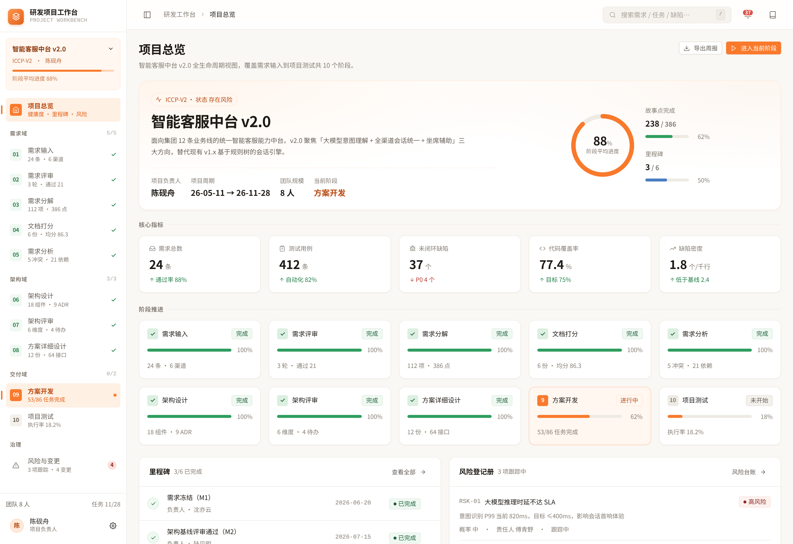

### 阶段页面（节选）

工作台左侧导航按「需求域 / 架构域 / 交付域」分组，每项带阶段序号、实时进度和状态标记。

| 需求输入 | 需求评审 |
| --- | --- |
| 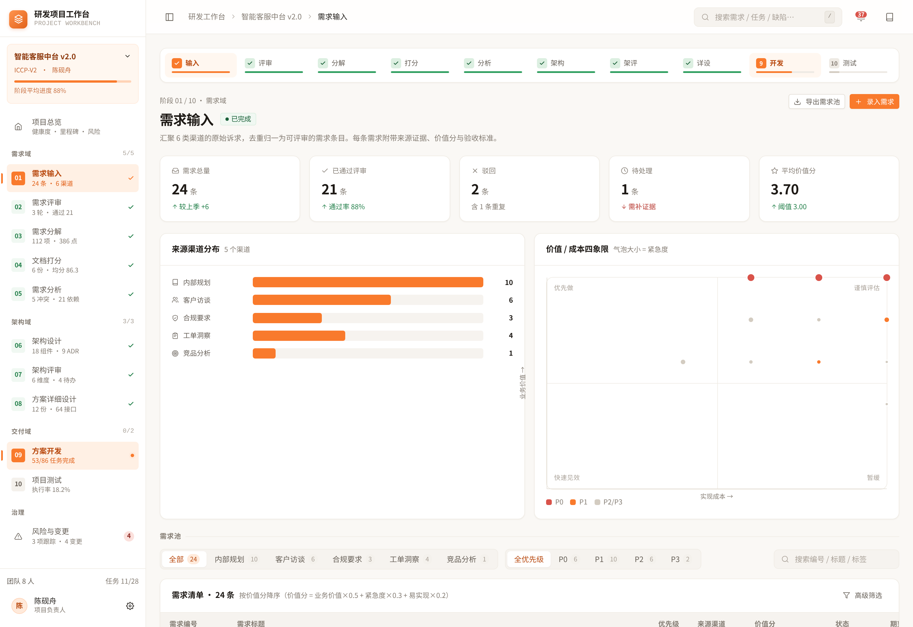 | 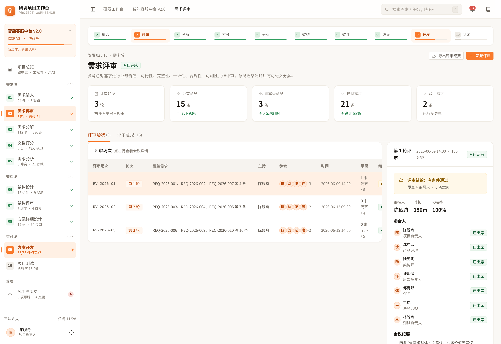 |

| 需求分解 | 需求文档打分 |
| --- | --- |
| 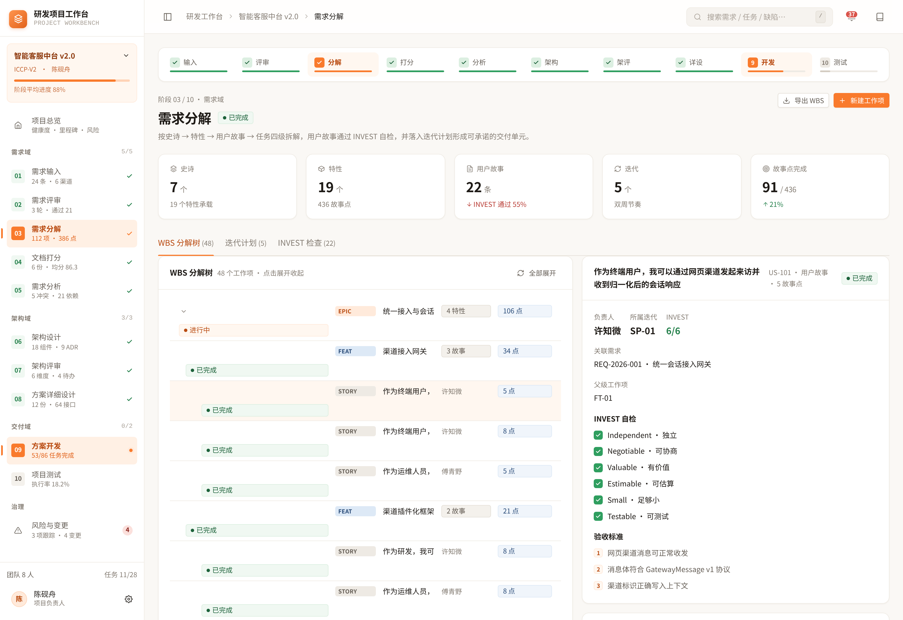 | 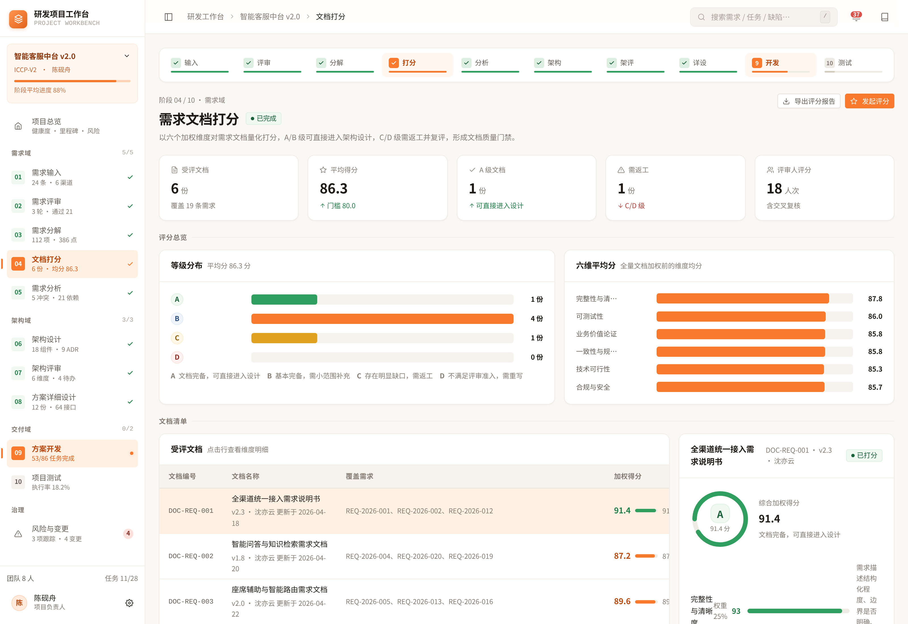 |

| 需求分析 | 架构设计 |
| --- | --- |
| 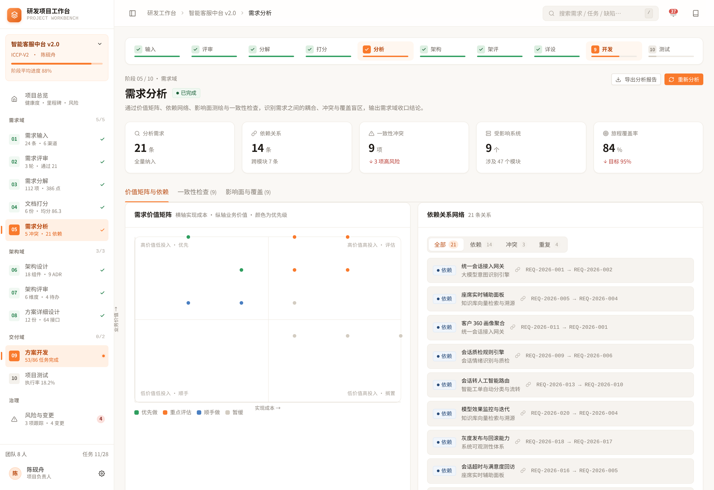 | 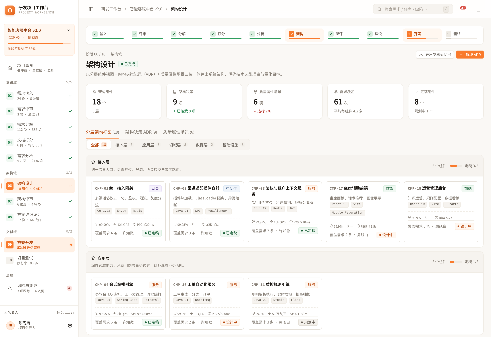 |

| 架构评审 | 方案详细设计 |
| --- | --- |
| 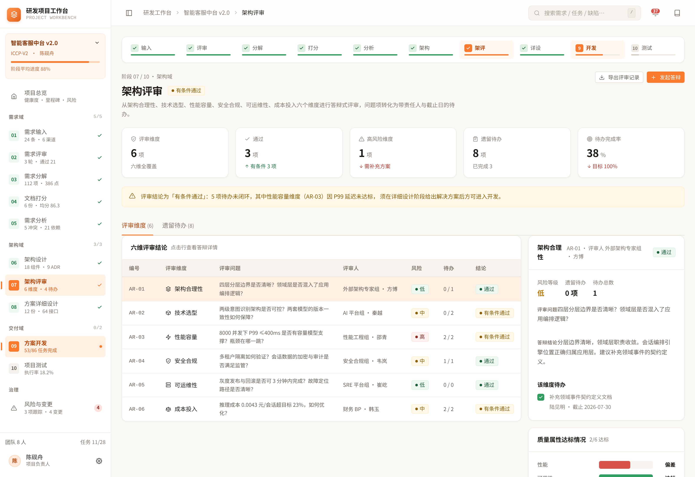 | 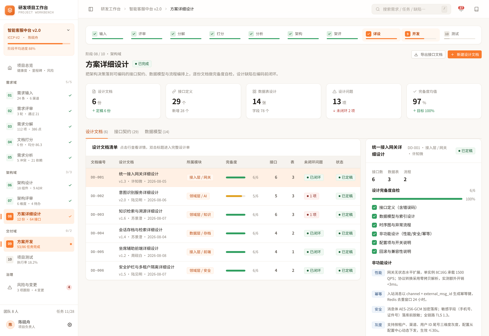 |

| 方案开发 | 项目测试 |
| --- | --- |
| 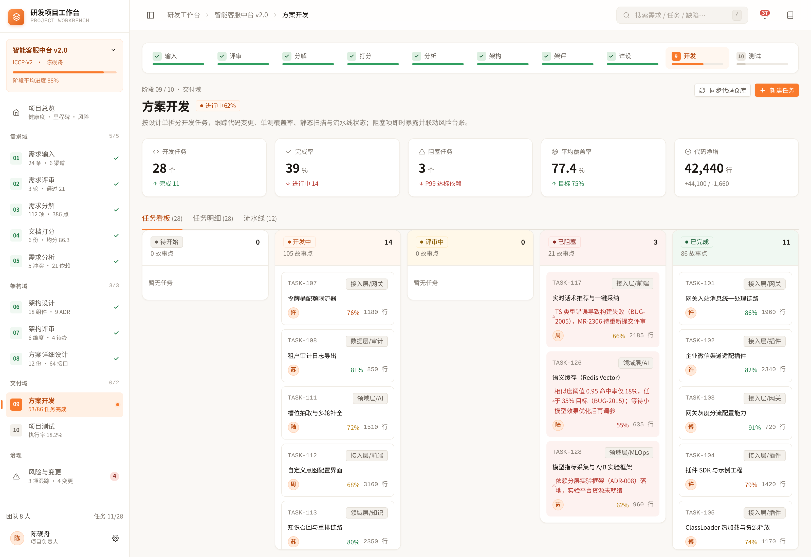 | 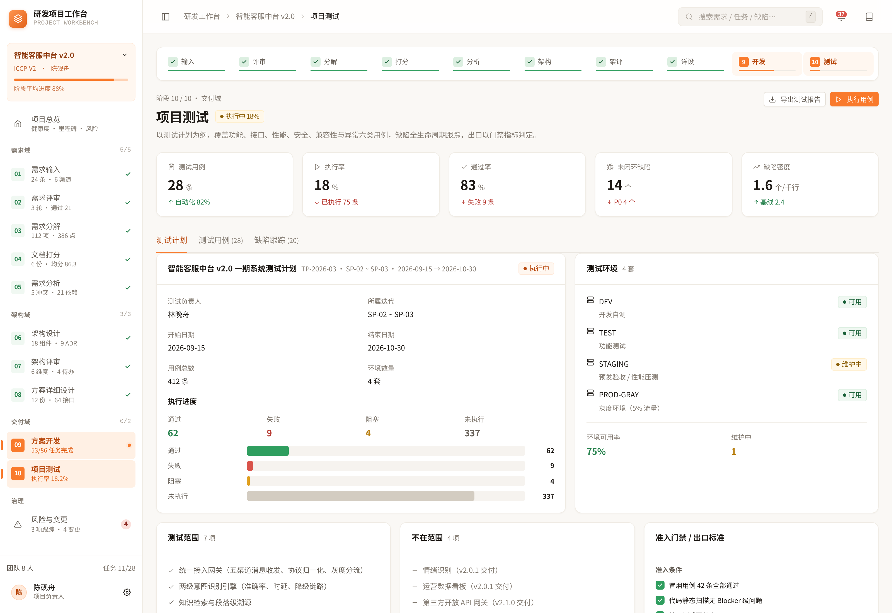 |

### 风险与变更

风险矩阵（概率 × 影响）、风险台账、变更请求三合一。

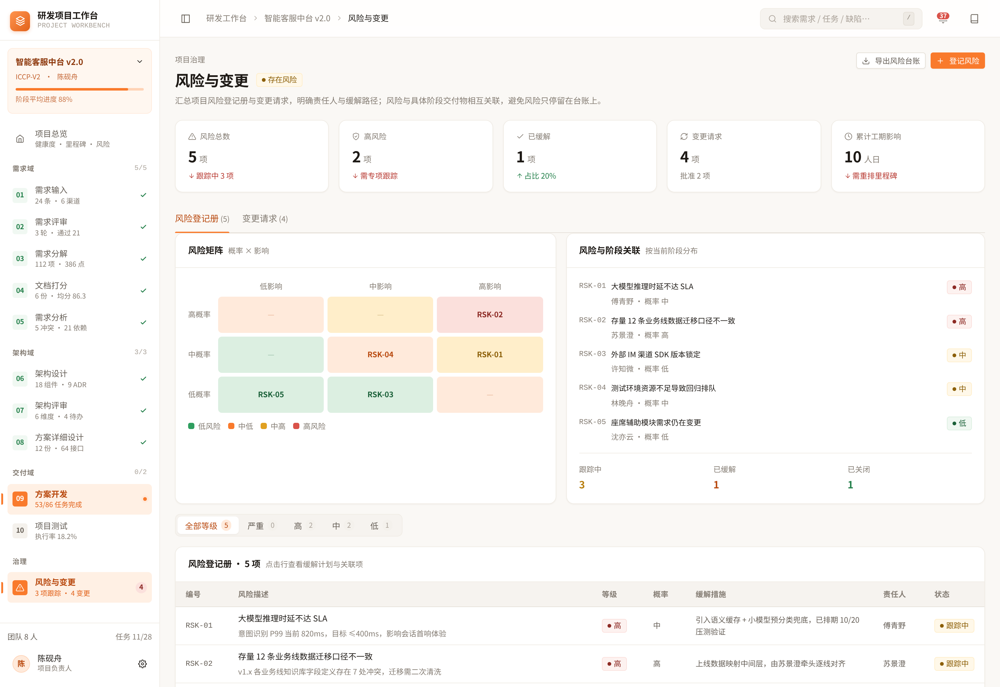

### 响应式

移动端侧边栏改为**浮层抽屉**，正文独占宽度；平板为折叠图标轨。

| 移动端 · 内容 | 移动端 · 抽屉导航 | 平板 |
| --- | --- | --- |
| 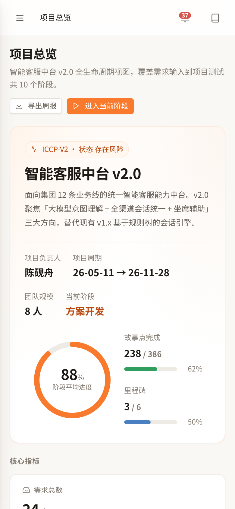 | 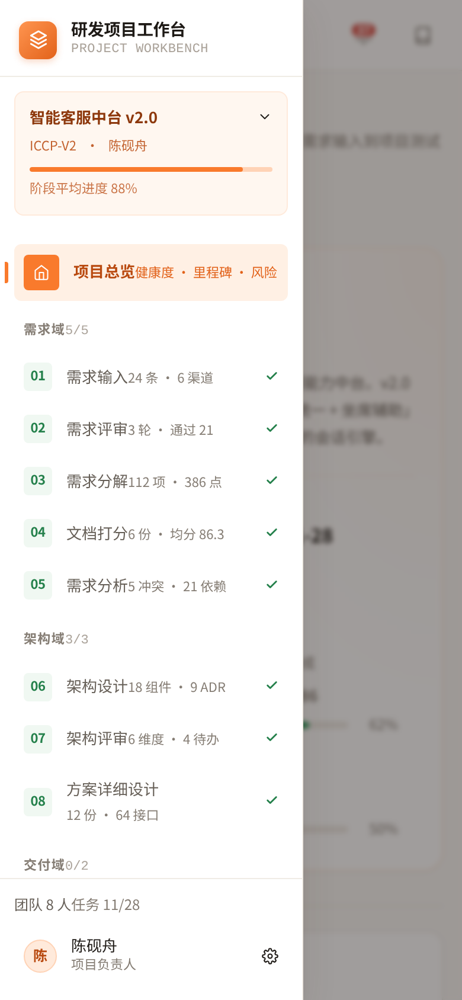 | 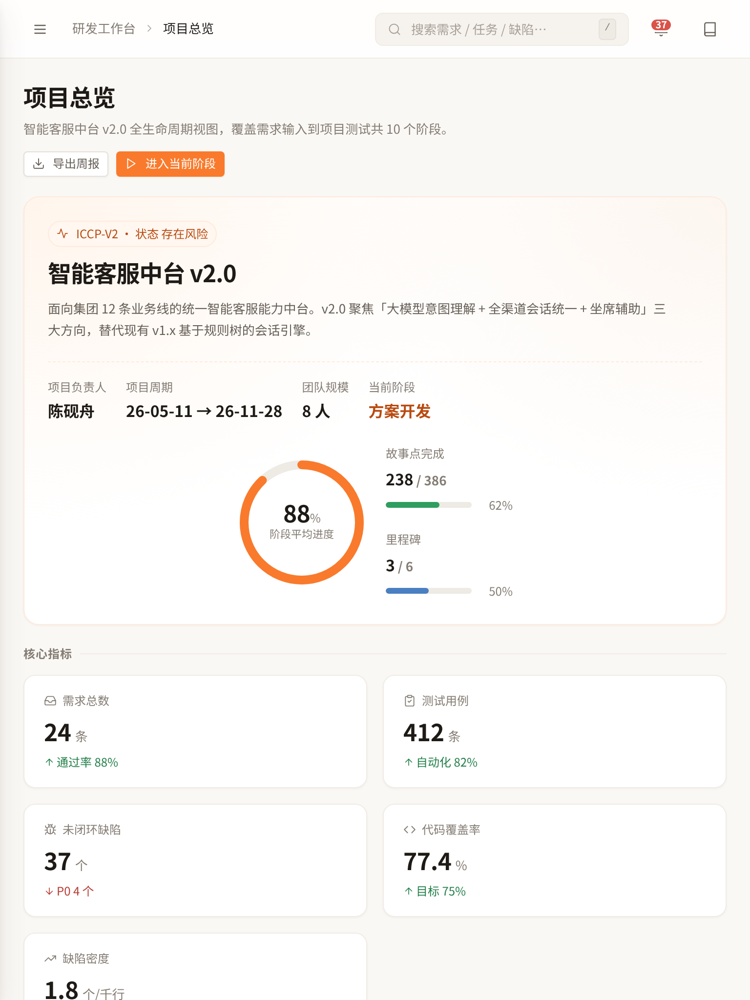 |

移动端看板（方案开发）保留五列语义，改为横向滚动 + `scroll-snap`：

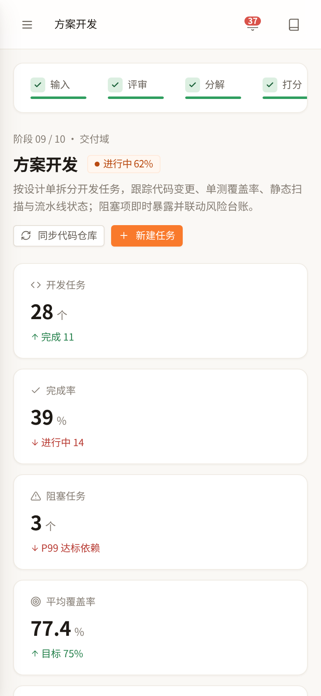

---

## 十个阶段

| # | 阶段 | 路由 | 核心内容 |
| --- | --- | --- | --- |
| — | 项目总览 | `/` | 健康度、里程碑、核心指标、阶段流程条 |
| 01 | 需求输入 | `/intake` | 6 渠道原始诉求汇总、去重归一、证据链、价值分 |
| 02 | 需求评审 | `/review` | 3 轮评审会话、逐条批注、通过/驳回/挂起 |
| 03 | 需求分解 | `/breakdown` | 史诗 → 特性 → 故事 → 任务、WBS、故事点 |
| 04 | 需求文档打分 | `/scoring` | 六维加权评分、A/B/C/D 质量分级、门禁 |
| 05 | 需求分析 | `/analysis` | 需求价值矩阵、依赖关系、影响面、冲突识别 |
| 06 | 架构设计 | `/arch-design` | 系统分层、9 份 ADR、18 个组件、技术选型 |
| 07 | 架构评审 | `/arch-review` | 六维度评审、待办项、风险与整改 |
| 08 | 方案详细设计 | `/detail-design` | 6 份设计文档、接口契约、64 个字段口径 |
| 09 | 方案开发 | `/development` | 五列看板、任务拆解、代码变更、覆盖率 |
| 10 | 项目测试 | `/testing` | 28 个用例、执行进度、缺陷分布、性能基线 |
| — | 风险与变更 | `/risks` | 风险矩阵、风险台账、变更请求 |

---

## 技术栈

| 层次 | 选型 | 说明 |
| --- | --- | --- |
| 框架 | **React 19.2** | 函数组件 + Hooks，`useMemo` 缓存派生计算 |
| 语言 | **TypeScript 6.0** | 全量类型覆盖，`strict` 模式；数据模型集中在 `types.ts` |
| 构建 | **Vite 8.3** | 极速冷启动与 HMR，生产构建基于 rolldown |
| 路由 | **React Router 7.18** | 嵌套路由 + `<Outlet />` 共享骨架 |
| 图表 | **Recharts 3.10** | 进度环、趋势线、分布图 |
| 样式 | **原生 CSS + 自定义属性** | 无 UI 框架、无 CSS-in-JS，四层样式文件 |
| 图标 | **手写内联 SVG** | 58 个图标，零外部依赖，统一 24×24 viewBox |
| 代码检查 | **oxlint** | 极快的 Rust 实现 linter |

**为什么不用组件库？** 这是一个演示高保真设计系统的项目，Ant Design / MUI 的默认视觉会覆盖掉「浅色系 + 暖色调」的设计意图。全手写样式换来的是 49 KB 的 CSS（gzip 后 9 KB）和完全可控的观感。

### 运行环境

- Node.js **>= 20.19**（推荐 22.x）
- 现代浏览器（Chrome / Edge / Safari / Firefox 最近两个大版本）

---

## 架构设计

### 整体分层

```
┌──────────────────────────────────────────────────────────┐
│                       App.tsx                            │
│              React Router 路由表（12 条）                  │
└────────────────────────┬─────────────────────────────────┘
                         │
┌────────────────────────▼─────────────────────────────────┐
│                  AppShell（应用骨架）                      │
│  ┌─────────────┬──────────────────────────────────────┐  │
│  │  Sidebar    │  Topbar（面包屑 / 搜索 / 通知）         │  │
│  │  分组导航    ├──────────────────────────────────────┤  │
│  │  进度 / 状态 │  Content                             │  │
│  │             │   └─ <Outlet /> ← 页面渲染于此         │  │
│  │  Footer     │                                      │  │
│  └─────────────┴──────────────────────────────────────┘  │
└────────────────────────┬─────────────────────────────────┘
                         │
        ┌────────────────┼────────────────┐
        ▼                ▼                ▼
┌──────────────┐ ┌──────────────┐ ┌──────────────┐
│   pages/     │ │ components/  │ │    data/     │
│  12 个页面    │ │  PageKit     │ │  纯数据层     │
│  组装展示层   │ │  Icon / UI   │ │  单一事实来源  │
└──────────────┘ └──────────────┘ └──────────────┘
```

### 布局骨架

左右结构由一层 CSS Grid 表达，侧栏宽度是设计令牌而非硬编码：

```css
.app-shell {
  display: grid;
  grid-template-columns: var(--sidebar-w) minmax(0, 1fr);
}
.app-shell.is-collapsed {
  grid-template-columns: var(--sidebar-w-collapsed) minmax(0, 1fr);
}
```

`minmax(0, 1fr)` 而非 `1fr` 是关键 —— 它允许内容区宽度收缩到 0 以下不发生溢出，否则内部超宽表格会把整个栅格撑破。

### 数据流

单向、无状态管理库：

```
data/*.ts  (静态数据源)
     │
     ▼
data/index.ts  (聚合 + 派生 stats)
     │
     ▼
页面组件  useMemo 按需切片
     │
     ▼
渲染
```

没有 Redux / Zustand / Jotai。原因是数据完全静态、无写操作，引入状态管理只会增加概念负担。

### 样式分层

| 文件 | 职责 | 约定 |
| --- | --- | --- |
| `tokens.css` | 设计令牌（颜色/间距/字号/圆角/阴影/动效） | 只定义变量，无选择器 |
| `layout.css` | 应用骨架（侧栏、顶栏、内容区、响应式） | 只管结构，不管业务 |
| `ui.css` | 通用组件（卡片、表格、徽章、进度条、栅格） | 可跨页面复用 |
| `pages.css` | 页面专属样式 | 前缀隔离，避免污染 |

---

## 核心设计

### 1. 派生指标单一事实来源

所有首页指标都从 `src/data/index.ts` 的 `stats` 派生，**不允许任何页面自行计算或硬编码**：

```ts
export const stats = {
  reqTotal:    requirements.length,          // 24
  reqPassRate: Math.round(/* 派生 */),        // 88%
  docAvgScore: /* 加权平均 */ 86.3,
  devDone:     /* 过滤状态 */ 11,
  coverage:    77.4,
  defectOpen:  37,
  // ...
} as const;
```

好处是改一处数据，全站 12 个页面的引用数字同步变化，不会出现「总览说 24 条、输入页说 26 条」的经典数据不一致问题。

### 2. 跨阶段证据链

示例数据不是孤立的假数据，实体之间通过 ID 真实引用，形成可回溯的链条：

| 链条 | 体现 |
| --- | --- |
| 风险 → 任务 → 缺陷 → 测试 | `RSK-01` → `TASK-126` 阻塞 → `BUG-2002` 未闭环 → `QA-01` P99 820ms 未达标 |
| 文档质量 → 返工 → 门禁 | `DOC-REQ-005` 76.3 分 C 级 → 触发返工 → 阻断阶段门禁 |
| 优先级冲突 → 迭代顺延 → 变更 | `REQ-2026-005` 与 `REQ-2026-009` 冲突 → 承诺顺延 → `CR-011` +5 人日 |

### 3. 阶段流程条

`FlowStrip` 复用同一份 `stageNav` 数据渲染 10 个阶段小卡，每卡展示序号/对勾、阶段名、进度条，并按 `status`（`done` / `active` / `pending` / `blocked`）切换语义色。

### 4. 侧栏状态与响应的分离

折叠状态**完全由 JS 控制**（`AppShell` 的 `collapsed` / `navOpen` 两个独立状态），媒体查询只负责「折叠后长什么样」。

> **踩过的坑**：早期版本用媒体查询 `display: none` 隐藏侧栏文字，选择器权重 `(0,2,0)` 高于 `.app-shell.is-collapsed .sb-item__body`，导致窄屏下即使用户点开侧栏也永远看不到文字。现在所有 `display` 切换都走状态类，媒体查询只调间距和字号。

### 5. 零内联栅格

页面里**禁止**写 `style={{ gridTemplateColumns }}`。内联样式权重高于媒体查询、无法被覆盖，窄屏必然溢出。所有栅格统一走语义类：

```css
.grid--split-even   /* 1 : 1 */
.grid--split-main   /* 1.35 : 1，主内容偏重 */
.grid--split-aside  /* 1.2 : 1 */
.grid--split-sticky /* 1 : 1.1，侧栏固定 */
.grid--tiles        /* 自适应小卡 */
.grid--board        /* 五列看板 */
.risk-matrix        /* 3×3 概率影响矩阵 */
```

---

## 快速开始

```bash
# 1. 安装依赖
npm install

# 2. 启动开发服务器（默认 http://localhost:5173）
npm run dev

# 3. 生产构建（含类型检查）
npm run build

# 4. 本地预览生产产物
npm run preview

# 5. 代码检查
npm run lint
```

### 部署说明

项目当前用 Vite dev server 直接对外提供服务，因此 `vite.config.ts` 中必须放开 host 与 host 校验（否则反向代理域名会被 Vite 拦截）：

```ts
export default defineConfig({
  plugins: [react()],
  server:  { host: '0.0.0.0', allowedHosts: true },
  preview: { host: '0.0.0.0', allowedHosts: true },
})
```

若部署到静态托管（Vercel / Netlify / Nginx），因为使用了 `BrowserRouter`，需要配置 SPA 回退规则，把所有未匹配路径重写到 `index.html`：

```nginx
location / {
  try_files $uri $uri/ /index.html;
}
```

---

## 目录结构

```
requirement-workbench/
├── docs/
│   └── screenshots/              # README 引用的效果图（16 张）
├── public/
├── src/
│   ├── components/
│   │   ├── layout/
│   │   │   ├── AppShell.tsx      # 应用骨架：侧栏 + 顶栏 + 内容区 + 响应式
│   │   │   ├── Sidebar.tsx       # 分组导航、进度、状态标记
│   │   │   └── PageKit.tsx       # PageHead / Section / DataTable 等页面套件
│   │   └── ui/
│   │       ├── Icon.tsx          # 58 个内联 SVG 图标
│   │       └── index.tsx         # Card / Badge / Progress / Stat 等原子组件
│   ├── data/
│   │   ├── types.ts              # 全部数据模型类型定义
│   │   ├── core.ts               # 项目、需求、评审、分解、文档打分、分析（1532 行）
│   │   ├── architecture.ts       # 架构设计、ADR、组件、详细设计（748 行）
│   │   ├── plan.ts               # 迭代与排期
│   │   ├── testing.ts            # 测试用例（280 行）
│   │   ├── qa.ts                 # 缺陷（199 行）
│   │   └── index.ts              # 聚合导出 + 派生 stats
│   ├── pages/                    # 12 个页面，一一对应路由
│   ├── styles/
│   │   ├── tokens.css            # 设计令牌
│   │   ├── layout.css            # 骨架与响应式
│   │   ├── ui.css                # 通用组件与栅格系统
│   │   └── pages.css             # 页面专属样式
│   ├── App.tsx                   # 路由表
│   └── main.tsx                  # 入口
├── index.html
├── vite.config.ts
└── package.json
```

---

## 示例数据说明

项目虚构了一个真实感的业务场景做承载：**智能客服中台 v2.0（ICCP-V2）** —— 面向集团 12 条业务线的统一智能客服能力中台，聚焦大模型意图理解、全渠道会话统一、座席辅助三大方向，替代现有 v1.x 基于规则树的会话引擎。

| 实体 | 数量 |
| --- | --- |
| 需求（REQ） | 24 |
| 需求文档 | 6 |
| 评审会话 | 3 轮 |
| 特性 / 故事 | 19 / 25 |
| 开发任务（TASK） | 28 |
| 架构决策记录（ADR） | 9 |
| 系统组件 | 18 |
| 详细设计文档 | 6 |
| 测试用例（TC） | 28 |
| 缺陷（BUG） | 20 |
| 变更请求（CR） | 若干 |

**关键指标**（均由数据派生，非硬编码）：需求通过率 88% · 文档均分 86.3 · 代码覆盖率 77.4% · 开发完成率 39% · 未闭环缺陷 37（P0 4 个）。

> 所有项目、人员、指标、组织均为**虚构示例数据**，不对应任何真实企业或系统。

---

## 响应式策略

三档断点逐级降级：

| 断点 | 侧栏 | 页面栅格 | 页头 |
| --- | --- | --- | --- |
| **≥ 1181px** | 展开 256px：图标 + 序号 + 说明 + 状态 | 双栏 / 五列看板 | 标题与操作同行 |
| **769 – 1180px** | 默认折叠为 72px 图标轨，可手动展开 | ≤1024px 两栏转单栏 | 操作区换行到下一行 |
| **≤ 768px** | **浮层抽屉**，覆盖式呼出，正文独占宽度 | 全部单栏；看板横向滚动 | 上下堆叠，标题整行 |

移动端抽屉的行为细节：点遮罩关闭、按 `Esc` 关闭、切换路由自动关闭、打开时锁定 body 滚动、抽屉内始终渲染完整导航（忽略桌面折叠态）。

### 验证方式

用 Playwright 对 **12 路由 × 4 视口（390 / 768 / 1024 / 1600）** 做回归，断言四项：

1. `documentElement.scrollWidth === clientWidth` —— 无横向溢出
2. `.page-head__title` 渲染宽度 ≥ 120px —— 标题未被 flex 挤压成竖排
3. 移动端 `.sidebar` 计算样式 `position === 'fixed'` —— 侧栏已脱离文档流
4. 控制台零 `pageerror` / 零 `error`

结果：**48 个组合全部通过**。

---

## 设计令牌

主色为**暖橙**，中性色为**暖灰**（而非冷灰），保证「浅色 + 暖调」的观感统一。全部集中在 `src/styles/tokens.css`，改一处即可全站换肤：

```css
--brand-500: #f97a2c;   /* 主品牌色 */
--brand-50:  #fff7f0;   /* 极浅底色，选中态 / 卡片高亮 */
--ink-900:   #241a14;   /* 主文本（暖黑） */
--surface-0: #fdfbf9;   /* 页面底色（暖白） */
--sidebar-w: 256px;     /* 侧栏展开宽度 */
--sidebar-w-collapsed: 72px;
```

---

## 已知限制

- **数据为静态内存数据**，无后端、无持久化，刷新即重置；所有交互为展示态，不含真实写操作。
- **搜索框为视觉占位**，未接实际检索逻辑。
- 部分页面（如需求分析的价值矩阵）使用示意图形，非严格数学建模。
- 生产构建的 JS 主包约 602 KB（gzip 166 KB），大头是 Recharts。若在意体积，可对图表组件做动态 `import()` 拆包。

---

## 许可

MIT License。示例业务数据（智能客服中台 v2.0 及其全部人员、指标、需求）均为虚构，仅用于演示，可自由替换。
